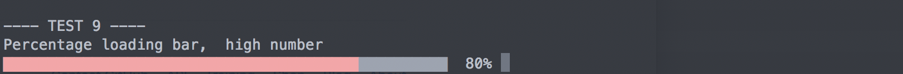
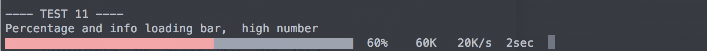
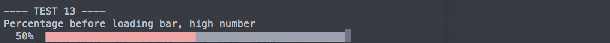

Python Loading Bar
=====================


Python module to display a nice loading bar in a terminal window.

Install
-------
Go to the module directory and run:
```
$ pip install setup.py
```

Or:
```
$ python3 setup.py install
```


Getting Started
---------------

There are 3 different loading bar:
1. Standard loading bar
2. Loading bar with size loaded, speed and remaining time
3. Loading bar with infos above plus a custom message (usefull to display a verbose loading bar)

## Option 1


```python
import loading
total_file_size = 1000
# Create a loading bar object with total_file_size in bytes
lb = loading.LoadingBar(total_file_size)

# For every piece of file
for chunk in file:
  # Update the loading bar with the len of new data
  lg.update(len(chunk))

# When finished, display a 100% loading bar
lg.done()
```

## Option 2


```python
import loading
total_file_size = 1000
lb = loading.InfoLoadingBar(total_file_size)
# Run as above
```

## Option 3

This special `InternetLoadingBar` smooth the speed calculation by taking the overall average time rather than a instant speed.

```python
import loading
total_file_size = 1000
lb = loading.InternetLoadingBar(total_file_size)
# Run as above
```

## Option 4


```python
import loading
total_file_size = 1000
lb = loading.VerboseLoadingBar(total_file_size)

# For every piece of file
for chunk in file:
  # Update the loading bar with the len of new data
  lg.update(len(chunk), "Message to be displayed, such as filename, etc.")

# When finished, display a 100% loading bar
lg.done()
```

## Option 5

Add a percentage after the loading bar.

* `loading.PercentageLoadingBar(tot_size)`


* `loading.PercentageInfoLoadingBar(tot_size)`


## Option 6

Add a percentage after the loading bar.

* `loading.PercentageBeforeLoadingBar(tot_size)`


* `loading.PercentageBeforeLoadingBarAndInfo(tot_size)`


Customization
-------------

If a new and custom loading bar is needed, you can implement a new one by inheriting from the LoadingBar class or the abstract class ILoadingBar.
See loading > loading_bar.py for examples.

License
-------
MIT license.
Feel free to use, share, or improve it.
